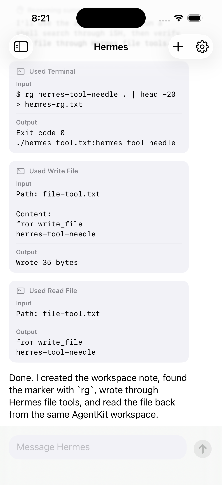

# AgentKit

AgentKit is a Swift package for embedding an AI agent inside an iOS app.

The current implementation ships Hermes as the first supported agent runtime. It embeds CPython, bundles Hermes and its Python dependencies, streams agent events back to SwiftUI, and gives the agent a useful iOS-safe workspace with file tools and an embedded iSH shell.

On iOS 26+, AgentKit can run the agent out of process in an ExtensionKit worker, so Hermes, Python, iSH, and native Python dependencies are isolated from the host app process.



## What You Get

- A high-level Swift API for creating an agent, sending messages, streaming events, and managing sessions.
- A sample iOS chat app that looks and behaves like a small agent client.
- Out-of-process execution on iOS 26+ via ExtensionKit and XPC.
- Embedded Python and Hermes packaging helpers.
- iSH-backed shell commands inside an app workspace.
- File read/write tools that work across the iOS host filesystem and the iSH workspace.
- Mock shell/model providers for tests.
- A local MLX model provider proof of concept.

For implementation details, package layout, limitations, and rebuild notes, see [Technical Details](docs/TECHNICAL_DETAILS.md).

## Install

Add AgentKit with Swift Package Manager:

```swift
.package(url: "https://github.com/achimala/AgentKit", branch: "main")
```

Then add the `AgentKit` product to your app target.

AgentKit uses binary XCFrameworks internally for Python, iSH, and shell support, but SPM is the easiest public integration shape because it can carry Swift sources, resources, binary targets, templates, tests, and scripts together.

## Embed Hermes

AgentKit expects the app bundle to include a Python payload at `PythonApp/hermes` by default. The package includes a pinned Hermes payload at `Payloads/Hermes/PythonApp` plus a build script that copies Hermes, stages platform-specific Python packages, installs the Python stdlib, and converts native Python extension modules into signed app frameworks.

Add this Run Script build phase to your app target:

```bash
set -euo pipefail
"${BUILD_DIR%/Build/*}/SourcePackages/checkouts/AgentKit/Scripts/agentkit-install-hermes.sh"
```

For local development against this repo, the sample app uses:

```bash
set -euo pipefail
"$PROJECT_DIR/../../Scripts/agentkit-install-hermes.sh"
```

Normal app builds do not fetch Hermes from the network. To intentionally update the vendored Hermes source, edit `Vendor/hermes-agent.lock` after reviewing the upstream release, then run:

```bash
./Scripts/update-hermes.sh
```

## Recommended: Add The Worker Extension

For iOS 26+, add an ExtensionKit worker so the agent runs outside your app process.

1. Add an ExtensionKit extension target to your app.

2. Link the `AgentKit` package product from both the app target and the extension target.

3. Create the worker boilerplate:

   ```bash
   ./Scripts/agentkit-scaffold-worker-extension.sh \
     --host-bundle-id com.example.MyApp \
     --output-dir AgentKitAgentWorker
   ```

4. Add the generated files to targets:

   - `AgentKitAgentWorker.swift` and `Info.plist` go in the extension target.
   - `AgentKitWorkerExtensionPoint.swift` goes in the host app target.

5. In the extension target build settings, enable:

   ```text
   EX_ENABLE_EXTENSION_POINT_GENERATION = YES
   ```

6. Add the same `agentkit-install-hermes.sh` Run Script phase to the extension target.

7. Make sure the host app embeds the extension target in `Embed ExtensionKit Extensions`.

That app-owned extension target is required by iOS. SPM can provide the code, resources, and scaffolding, but the consuming app must own the `.appex` bundle, signing, and embedding relationship.

## Use It

```swift
import AgentKit

let configuration = HermesAgentConfiguration.openAI(
    apiKey: apiKey,
    model: "gpt-4.1-mini"
)

let agent: HermesAgent
if #available(iOS 26.0, *) {
    agent = try HermesAgent(
        configuration: configuration,
        sourceURL: HermesAgent.bundledSourceURL(),
        backend: HermesExtensionProcessBackend(appExtensionPoint: .agentKitAgentWorker)
    )
} else {
    agent = try HermesAgent(configuration: configuration)
}

let response = try agent.send("Create hello.txt and read it back") { event in
    print(event.kind, event.payload)
}
```

Session management is available on the same facade:

```swift
let state = try agent.sessionState()
let newSession = try agent.newSession()
let restored = try agent.loadSession(sessionID)
```

For offline MLX experiments:

```swift
let agent = try HermesAgent(
    configuration: .localMLX(
        model: AgentKitLocalMLXModels.qwen35_2BOptiQ4Bit,
        maxTokens: 128,
        temperature: 0.2
    )
)
```

## Try The Sample

```bash
xcodebuild \
  -project Examples/HermesAgentSample/HermesAgentSample.xcodeproj \
  -scheme HermesAgentSample \
  -destination 'platform=iOS Simulator,name=iPhone 17 Pro,OS=26.5' \
  build

xcrun simctl install booted \
  ~/Library/Developer/Xcode/DerivedData/HermesAgentSample-eqgicvlbvbqhprgqnxtyipafsxsd/Build/Products/Debug-iphonesimulator/HermesAgentSample.app

xcrun simctl launch booted com.daysail.HermesAgentSample
```

To run on a physical device, create a private local signing config:

```bash
cp Examples/HermesAgentSample/Local.xcconfig.example \
  Examples/HermesAgentSample/Local.xcconfig
```

Then edit `Examples/HermesAgentSample/Local.xcconfig` with your Apple development team ID and a bundle ID prefix you own. That file is ignored by git, so your personal signing identity does not get committed.

In the sample app, configure an OpenAI-compatible endpoint in settings, send a message, and watch reasoning summaries, tool calls, tool output, timing, and final responses stream back into the chat.

## Current Status

Verified in simulator and generic iOS builds:

- Hermes initializes inside the iOS app bundle.
- The ExtensionKit backend runs Hermes out of process on iOS 26+.
- Terminal calls run through a persistent iSH ARM64 Alpine shell.
- File read/write tools work in the AgentKit workspace.
- Hermes memory, context, and soul can persist under Application Support.
- The local MLX provider runs as an offline proof of concept, though the small 2B model is weak at tool use.

AgentKit is still a proof of concept. Hermes is the only supported agent implementation today, and some desktop-style tools are intentionally unavailable on iOS.
