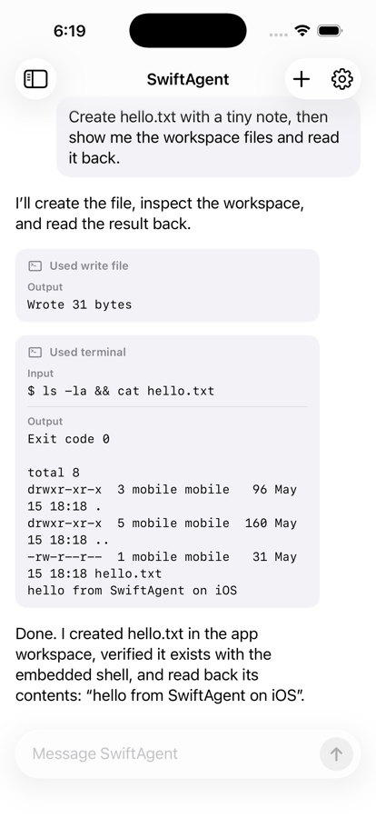

# SwiftAgent

SwiftAgent is a Swift package for embedding an AI agent inside an iOS app.

The current implementation ships Hermes as the first supported agent runtime. It embeds CPython, bundles Hermes and its Python dependencies, streams agent events back to SwiftUI, and gives the agent a useful iOS-safe workspace with file tools and an embedded iSH shell. SwiftAgent currently runs Hermes in process.



## What You Get

- A high-level Swift API for creating an agent, sending messages, streaming events, and managing sessions.
- A sample iOS chat app that looks and behaves like a small agent client.
- Embedded Python and Hermes packaging helpers.
- iSH-backed shell commands inside an app workspace.
- File read/write tools that work across the iOS host filesystem and the iSH workspace.
- Mock shell/model providers for tests.
- An optional local MLX model provider proof of concept.
- An optional Apple Foundation Models provider experiment for iOS 26+ on-device inference.

For implementation details, package layout, limitations, and rebuild notes, see [Technical Details](docs/TECHNICAL_DETAILS.md).

## License

SwiftAgent is licensed under GPLv3. The embedded iSH dependency is GPLv3, so SwiftAgent follows the same license. Hermes Agent is MIT-licensed and remains attributed to its upstream project.

## Install

Add SwiftAgent with Swift Package Manager:

```swift
.package(url: "https://github.com/achimala/SwiftAgent", branch: "main")
```

Then add the `SwiftAgent` product to your app target.

SwiftAgent uses binary XCFrameworks internally for Python, iSH, and shell support, but SPM is the easiest public integration shape because it can carry Swift sources, resources, binary targets, templates, tests, and scripts together.

## Embed Hermes

SwiftAgent expects the app bundle to include a Python payload at `PythonApp/hermes` by default. The package includes a pinned Hermes source lock, checked-in Python dependency layers, and a build script that fetches the pinned Hermes release if needed, stages platform-specific Python packages, installs the Python stdlib, and converts native Python extension modules into signed app frameworks.

Add this Run Script build phase to your app target:

```bash
set -euo pipefail
"${BUILD_DIR%/Build/*}/SourcePackages/checkouts/SwiftAgent/Scripts/swiftagent-install-hermes.sh"
```

For local development against this repo, the sample app uses:

```bash
set -euo pipefail
"$PROJECT_DIR/../../Scripts/swiftagent-install-hermes.sh"
```

Fresh checkouts fetch the pinned Hermes source on the first build. To prefetch explicitly, or to refresh after editing `Vendor/hermes-agent.lock`, run:

```bash
./Scripts/update-hermes.sh
```

Set `SWIFTAGENT_AUTO_FETCH_HERMES=NO` in the build phase environment if CI should fail instead of fetching when the local Hermes payload is missing.

## Use It

```swift
import SwiftAgent

let configuration = HermesAgentConfiguration.openAI(
    apiKey: apiKey,
    model: "gpt-4.1-mini"
)

let agent = try HermesAgent(configuration: configuration)
let response = try agent.send("Create hello.txt and read it back") { event in
    print(event.kind, event.payload)
}
```

Session management is available on the same facade:

```swift
let state = try agent.sessionState()
let newSession = try agent.newSession()
let restored = try agent.loadSession(sessionID)
```

For offline MLX experiments, add the local `Packages/SwiftAgentMLX` add-on package and link its `SwiftAgentMLX` product. This keeps the default `SwiftAgent` package from resolving or building MLX dependencies unless an app opts into local models.

```swift
import SwiftAgent
import SwiftAgentMLX

let agent = try HermesAgent(
    configuration: .localMLX(
        model: SwiftAgentLocalMLXModels.qwen35_2BOptiQ4Bit,
        maxTokens: 128,
        temperature: 0.2
    ),
    sourceURL: HermesAgent.bundledSourceURL(),
    modelProvider: SwiftAgentMLXModelProvider()
)
```

For Apple Foundation Models experiments on iOS 26+, add the local `Packages/SwiftAgentFoundationModels` add-on package and link its `SwiftAgentFoundationModels` product:

```swift
import SwiftAgent
import SwiftAgentFoundationModels

let agent = try HermesAgent(
    configuration: .foundationModels(maxTokens: 160, temperature: 0.1),
    sourceURL: HermesAgent.bundledSourceURL(),
    modelProvider: SwiftAgentFoundationModelsProvider()
)
```

## Try The Sample

```bash
xcodebuild \
  -project Examples/HermesAgentSample/HermesAgentSample.xcodeproj \
  -scheme HermesAgentSample \
  -destination 'platform=iOS Simulator,name=iPhone 17 Pro,OS=26.5' \
  build

xcrun simctl install booted \
  ~/Library/Developer/Xcode/DerivedData/HermesAgentSample-eqgicvlbvbqhprgqnxtyipafsxsd/Build/Products/Debug-iphonesimulator/HermesAgentSample.app

xcrun simctl launch booted com.daysail.HermesAgentSample
```

To run on a physical device, create a private local signing config:

```bash
cp Examples/HermesAgentSample/Local.xcconfig.example \
  Examples/HermesAgentSample/Local.xcconfig
```

Then edit `Examples/HermesAgentSample/Local.xcconfig` with your Apple development team ID. That file is ignored by git, so your personal signing identity does not get committed.

In the sample app, configure an OpenAI-compatible endpoint in settings, send a message, and watch reasoning summaries, tool calls, tool output, timing, and final responses stream back into the chat.

## Current Status

Verified in simulator and generic iOS builds:

- Hermes initializes inside the iOS app bundle.
- Hermes runs in process.
- Terminal calls run through a persistent iSH ARM64 Alpine shell.
- File read/write tools work in the SwiftAgent workspace.
- Hermes memory, context, and soul can persist under Application Support.
- The optional local MLX add-on runs as an offline proof of concept, though the small 2B model is weak at tool use.
- The optional Apple Foundation Models add-on can run Hermes chat and basic file-tool loops on device, but still needs a more curated agent/tool layer.

SwiftAgent is still a proof of concept. Hermes is the only supported agent implementation today, and some desktop-style tools are intentionally unavailable on iOS.
